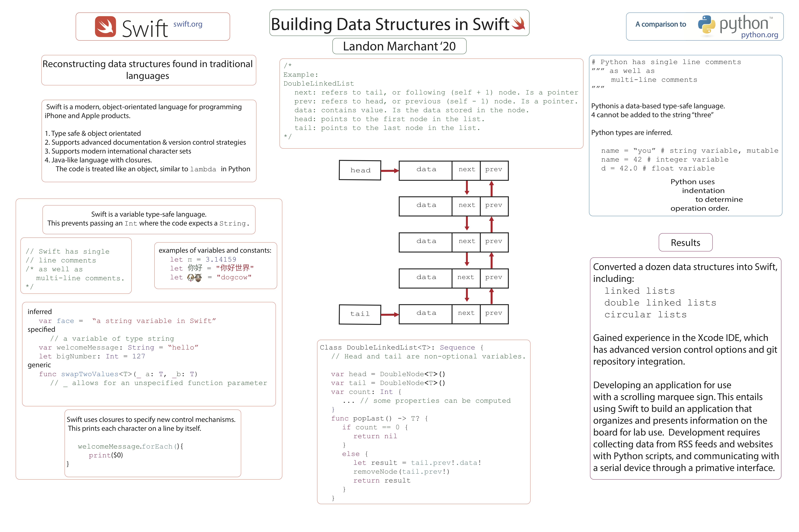

Assisted in clean-room development of [Swift data structures](https://github.com/londonmeanswild/swift), following Apple design principles. The Swift structures provide programmers with experimental data structure classes including LinkedLists, DoublyLinked Lists, and Circular Lists. [Swift is an open-source programming language developed by Apple.](https://developer.apple.com/swift/) Summer 2017. 
     

